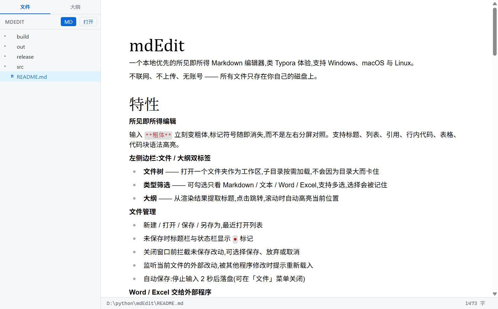

# mdEdit

一个本地优先的所见即所得 Markdown 编辑器,类 Typora 体验,支持 Windows、macOS 与 Linux。

不联网、不上传、无账号 —— 所有文件只存在你自己的磁盘上。



## 特性

**所见即所得编辑**

输入 `**粗体**` 立刻变粗体,标记符号随即消失,而不是左右分屏对照。支持标题、列表、引用、行内代码、表格、代码块语法高亮。

**左侧边栏:文件 / 大纲双标签**

- **文件树** —— 打开一个文件夹作为工作区,子目录按需加载,不会因为目录大而卡住
- **类型筛选** —— 可勾选只看 Markdown / 文本 / Word / Excel,支持多选,选择会被记住
- **大纲** —— 从渲染结果提取标题,点击跳转,滚动时自动高亮当前位置

**文件管理**

- 新建 / 打开 / 保存 / 另存为,最近打开列表
- 未保存时标题栏与状态栏显示 `●` 标记
- 关闭窗口前拦截未保存改动,可选择保存、放弃或取消
- 监听当前文件的外部改动,被其他程序修改时提示重新载入
- 自动保存:停止输入 2 秒后落盘(可在「文件」菜单关闭)

**Word / Excel 交给外部程序**

`.doc` `.docx` `.xls` `.xlsx` `.csv` 无法在应用内编辑,点击后弹出打开方式菜单,可用默认程序打开或指定其他应用,用过的应用会被记住。

**查找替换**(`Ctrl+F`)

全文高亮所有匹配,当前项单独着色,支持上一个 / 下一个(首尾环绕)、替换当前、全部替换。

**Markdown 与纯文本互转**

「文件 → 导出」下的两项都会另存为新文件,不接管正在编辑的文档,原文件与未保存状态都不受影响。

- **导出为纯文本** —— 剥掉行内标记,但把结构留在文字里:标题带层级编号(`1` / `1.1` / `1.1.1`),一二级另加下划线;列表保留前缀与缩进,任务列表保留勾选;表格按显示宽度补空格对齐;链接保留地址。用记事本打开也读得出层次。
- **转换为 Markdown** —— 反过来识别纯文本里的结构:孤立的短行升级为标题(带 `1.2` 这类编号的按编号定级),`•` `·` 等符号以及 `(1)` `一、` 编号转成标准列表,四空格缩进块转成围栏代码块。

后者是启发式识别,对排版随意的文本可能判错;已经是 Markdown 的部分会原样保留,重复执行不会越改越乱。

**保存不改写你的原有格式**

这是本项目着力处理的一点。所见即所得编辑器在保存时会重新序列化整篇文档,很容易把你原来的写法改掉。mdEdit 做了这些约束:

- 列表符号固定用 `-`,不会被改成 `*`
- 空行就是空行,不会被写成 `<br />`
- 文末换行数量统一,**打开后直接保存不会产生任何改动**
- 表格按字符的显示宽度对齐(中日韩字符计 2 列),中文表格源码也能对齐:

```markdown
| 里程碑 | 内容             | 状态 |
| ------ | ---------------- | ---- |
| M1     | 脚手架           | 完成 |
| M3     | 文件读写与文件树 | 完成 |
```

## 下载

前往 [Releases](https://github.com/Eoneanyna/mdEdit/releases) 页面下载。

| 系统 | 文件 | 说明 |
| --- | --- | --- |
| Windows | `mdEdit-<版本>-win-x64.exe` | NSIS 安装包,可自选安装目录 |
| macOS | `mdEdit-<版本>-mac-x64.dmg` | Intel 芯片 |
| macOS | `mdEdit-<版本>-mac-arm64.dmg` | Apple Silicon |
| Linux | `mdEdit-<版本>-linux-x86_64.AppImage` | 免安装,`chmod +x` 后直接运行 |
| Linux | `mdEdit-<版本>-linux-amd64.deb` | Debian / Ubuntu |

> **说明**:目前仅提供 Windows 安装包。macOS 与 Linux 的产物需自行构建 —— macOS 的 `.dmg` 受签名机制限制,**必须在 macOS 上打包**,无法交叉编译。构建方式见下文。

## 技术栈

| 层 | 选型 | 为什么 |
| --- | --- | --- |
| 桌面外壳 | [Electron](https://www.electronjs.org/) 43 | 内置 Chromium,三平台渲染一致。Tauri / Wails 体积更小,但在 Linux 上依赖系统 webkit2gtk,对这类重排版应用的样式差异代价过高 |
| 编辑器内核 | [@milkdown/crepe](https://milkdown.dev/) 7(基于 ProseMirror) | 结构化文档模型,真正的所见即所得;而非 CodeMirror 那种「纯文本 + 装饰」的路线 |
| 构建 | [electron-vite](https://electron-vite.org/) 5 + Vite 7 | 主进程 / 预加载 / 渲染层统一配置,渲染层 HMR 开箱即用 |
| 打包 | [electron-builder](https://www.electron.build/) 26 | 一套配置产出三平台安装包 |
| 语言 | TypeScript 7 | 主进程与渲染进程分别用独立的 tsconfig,渲染层不引入 Node 类型以防误用 |
| 文件监听 | [chokidar](https://github.com/paulmillr/chokidar) 5 | 检测当前文件的外部改动 |

**安全约定**:渲染进程禁用 `nodeIntegration`、启用 `contextIsolation`,所有文件操作经由 IPC 交给主进程;主进程把异常收敛为 `Result` 类型,不把异常栈透给渲染层。

## 从源码构建

需要 Node.js 20 或更高版本。

```bash
git clone https://github.com/Eoneanyna/mdEdit.git
cd mdEdit
npm install
```

开发模式(带热更新):

```bash
npm run dev
```

打包(**只能在对应系统上执行**):

```bash
npm run build:win     # Windows -> release/*.exe
npm run build:mac     # macOS   -> release/*.dmg
npm run build:linux   # Linux   -> release/*.AppImage, *.deb
```

其他命令:

```bash
npm run typecheck     # 主进程与渲染层分别做类型检查
npm run build         # 只编译,不打包
npm start             # 以生产模式预览
```

### 国内网络说明

Electron 与 electron-builder 的二进制默认从 GitHub Release 拉取,国内常超时。项目已在 [.npmrc](.npmrc) 与 [electron-builder.yml](electron-builder.yml) 中各配置了一份 npmmirror 镜像,正常情况下 `npm install` 与打包都能直接跑通,无需额外设置。

若使用 npm 12 及以后的版本,`.npmrc` 中的自定义配置项可能失效,届时改为导出环境变量即可:

```bash
export ELECTRON_MIRROR=https://npmmirror.com/mirrors/electron/
```

## 项目结构

```
src/
├── shared/ipc.ts          # 主进程与渲染进程共享的 IPC 契约与类型
├── main/                  # 主进程
│   ├── window.ts          #   窗口创建、关窗拦截
│   ├── menu.ts            #   原生菜单(含最近打开、自动保存开关)
│   ├── store.ts           #   配置持久化(工作区、最近文件、筛选、外部应用)
│   └── ipc/               #   文件读写、目录扫描、外部程序启动、文件监听
├── preload/index.ts       # contextBridge 白名单
└── renderer/src/          # 渲染层
    ├── editor/            #   编辑器封装、序列化格式约束、显示宽度计算
    ├── sidebar/           #   文件树、打开方式菜单
    ├── outline/           #   大纲面板
    ├── search/            #   查找替换(ProseMirror 插件 + 界面)
    ├── state/             #   文档状态机、字数统计
    └── ui/                #   通用浮层菜单
```

## 已知限制

- **查找不跨样式边界** —— 形如 `重**点**` 的文本在文档模型里是两个节点,搜索"重点"不会命中
- **表格分隔行会被规范化** —— `| --- |` 会按列宽变成 `| ------ |`。这是 Markdown 序列化器的固有行为,配置无法关闭;好在它合法、渲染一致,且反复保存内容稳定
- **`.txt` 按 Markdown 解析** —— 若纯文本里恰好含有 `#`、`*` 等字符,保存后可能被转成对应的 Markdown 语法
- **安装包约 106 MB** —— Electron 应用的固有体积,其中运行时本身占绝大部分

## 协议

[MIT](LICENSE)

## 作者

cxy · [adc.rabbit@foxmail.com](mailto:adc.rabbit@foxmail.com)

问题与建议欢迎提到 [Issues](https://github.com/Eoneanyna/mdEdit/issues)。
